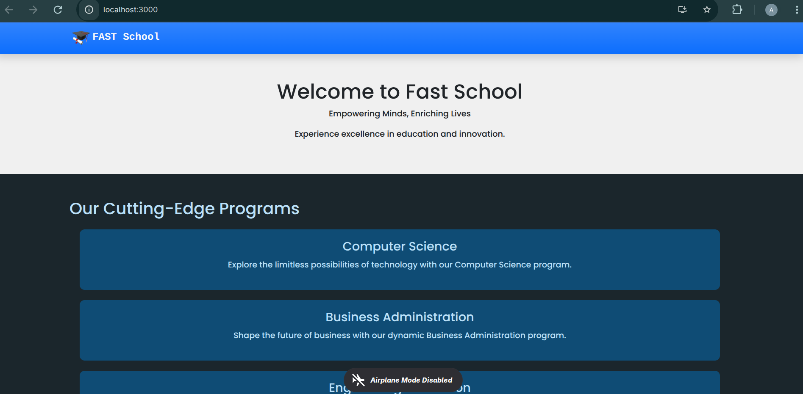
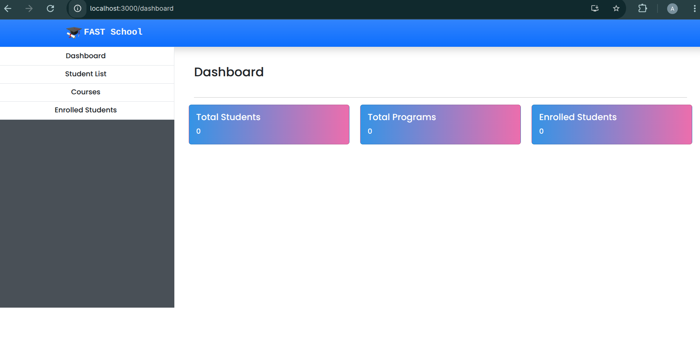
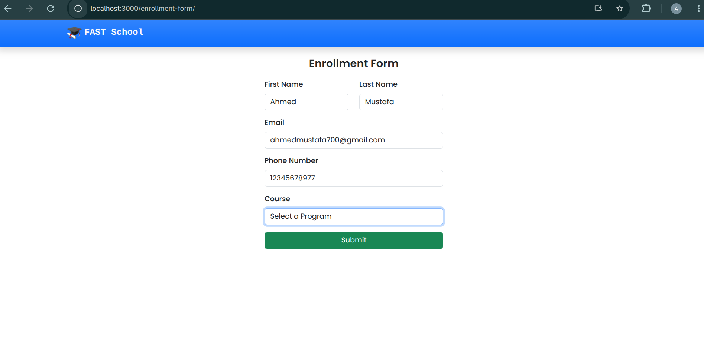
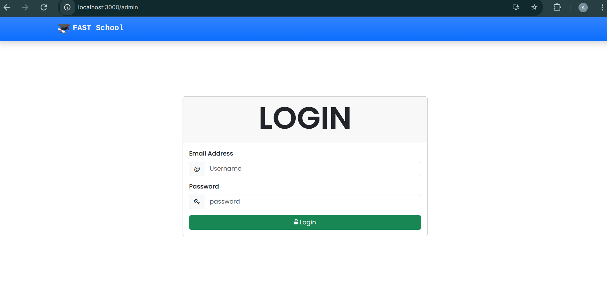

# School Management System

A comprehensive web-based School Management System designed to streamline school administration, student enrollment, and academic management processes.



## Features

- **User Authentication**
  - Secure login system for administrators, teachers, and students
  - Role-based access control

- **Dashboard**
  - Overview of key metrics and statistics
  - Quick access to important functions
  - Upcoming events and announcements



- **Student Management**
  - Student registration and profile management
  - Academic records and performance tracking
  - Attendance management

- **Enrollment System**
  - Online course enrollment
  - Class scheduling
  - Fee management



- **Teacher Portal**
  - Class and subject assignment
  - Gradebook functionality
  - Attendance marking

- **Parent Portal**
  - Monitor student progress
  - View attendance records
  - Communication with teachers

## Getting Started

### Prerequisites

- Node.js (v14 or higher)
- npm or yarn
- MongoDB (or MongoDB Atlas)

### Installation

1. Clone the repository
   ```bash
   git clone https://github.com/yourusername/SchoolManagementApp.git
   cd SchoolManagementApp
   ```

2. Install dependencies
   ```bash
   npm install
   # or
   yarn install
   ```

3. Set up environment variables
   Create a `.env` file in the root directory and add the following:
   ```
   MONGODB_URI=your_mongodb_connection_string
   JWT_SECRET=your_jwt_secret
   PORT=3000
   ```

4. Start the development server
   ```bash
   npm run dev
   # or
   yarn dev
   ```

5. Open [http://localhost:3000](http://localhost:3000) in your browser

## Login

Access the login page to enter the system:



## Technologies Used

- **Frontend**: React.js, Redux
- **Backend**: ASP.NET
- **Database**: MySQL
- **Authentication**: JWT


